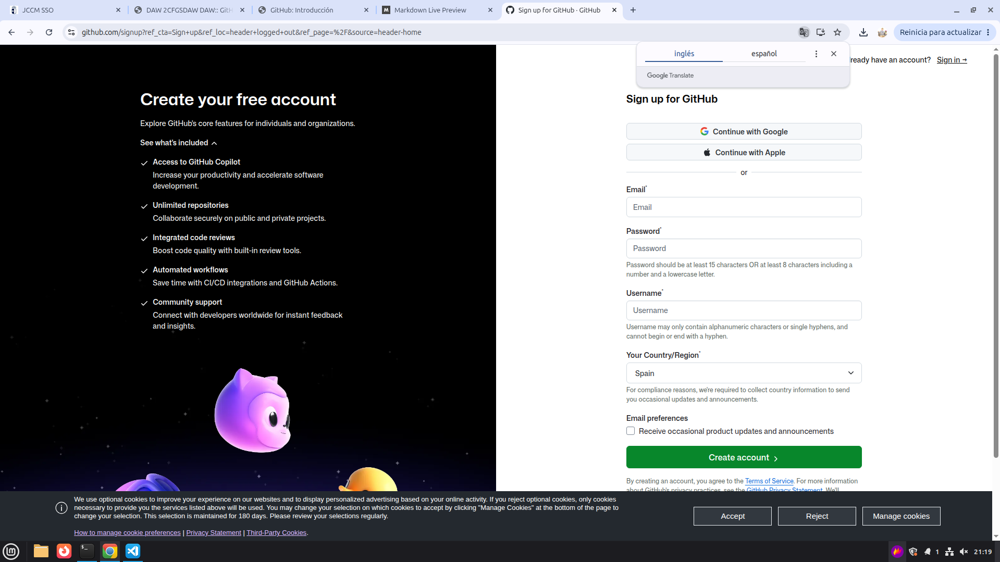

# Github + Markdown  
## Álvaro Rodrigo Morales
```
Github es un sistema de guardado en la nube disponible para que los desarrolladores puedan colaborar en proyectos de código abierto y crear sus propios repositorios. Además, se puede conectar con git en local para tener un control de versiones mas precíso.  
```
```
En este documento, veremos como crearnos una cuenta, crear un repositorio, añadir un archivo a nuestro repositorio y como eliminar un repositorio.
```
### 1. Crear una cuenta de github
Para crear una cuenta pinchámos en el siguiente botón de la página principal:


a continuación rellenaremos el siguiente formulario:



tras crear una cuenta aparecceremos en el siguiente menú:

